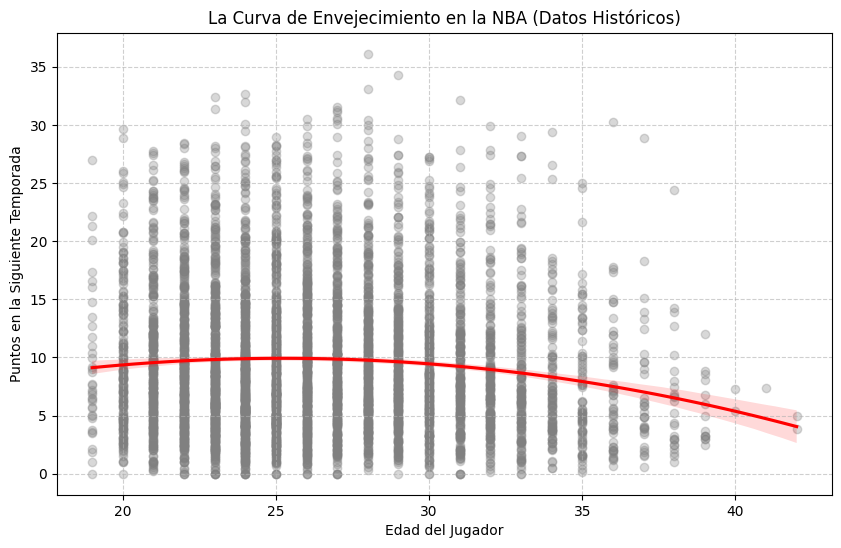

# 🏀NBA_Perfomance_Predictor: Predicción de Rendimiento con Machine Learning

**¿Es posible predecir el futuro de una superestrella de la NBA usando solo estadística y ciencia de datos?** 

Este proyecto desarrolla un motor predictivo que proyecta los Puntos por Partido (PPG) de los jugadores para la temporada 2025-26. A través de un análisis histórico de 15 años y el uso de modelos de regresión, este notebook demuestra que la parsimonia (simplicidad) y el entendimiento biológico del atleta suelen superar a los algoritmos más complejos.

# 🎯 El Desafío: 

El rendimiento deportivo es volátil. El reto consistió en filtrar el "ruido" de las estadísticas básicas para encontrar los verdaderos predictores del éxito.

**Pregunta clave: ¿Puede un modelo simple de Regresión Lineal vencer a un Random Forest al incorporar la "Curva de Envejecimiento" de los jugadores?**
________________________________________
# 🛠️ Stack Tecnológico

    -- Lenguaje: Python 3.x
    -- Librerías: nba_api, pandas, scikit-learn, seaborn, matplotlib.
    -- Dataset: +15 temporadas de datos oficiales de la NBA (2010-2025).
________________________________________
# 🧠 El "Core" del Proyecto: Hallazgos de Ingeniería de Datos

**1. La Curva de Envejecimiento (*The Breakthrough*)**

El mayor salto en precisión ($R^2$ de 0.75 a 0.78) ocurrió al dejar de tratar la edad como una variable lineal. Implementé un Ajuste Polinomial ($Edad + Edad^2$) para modelar el ciclo de vida del atleta: el crecimiento explosivo del novato, el "prime" físico y el declive inevitable del veterano.

**2. El Impuesto a la Eficiencia**

Descubrimos que el volumen de tiros (FGA) y los minutos jugados actúan como armas de doble filo. El modelo penaliza el volumen si no viene acompañado de una eficiencia real, permitiendo predecir "regresiones a la media" en jugadores con alto volumen pero baja efectividad.
________________________________________
# 📊 Comparativa de Modelos
En este proyecto, la honestidad técnica es prioridad. Evaluamos dos enfoques:

Modelo               |R-Cuadrado(R2) |Error Medio(MAE)| Resultado
---------------------|---------------|----------------|----------------
Regresión Lineal (V2)|     0.7797    |  2.31 pts      | Ganador
Random Forest        |     0.7388    |  2.56 pts      | Descartado por Overfitting
-----------------------------------------------------------------------

**Conclusión**: El modelo lineal fue más robusto. Esto demuestra que en conjuntos de datos con fuertes relaciones biológicas, los modelos interpretables suelen ser superiores a las "cajas negras" de IA.
________________________________________
# 🔮 Predicciones para la Temporada 2025-26
El "Oráculo" ha hablado. Estas son las proyecciones para tres perfiles distintos:
 -- Victor Wembanyama (El Unicornio): A pesar de la regresión estadística natural, su juventud actúa como un escudo. Proyección: Estable (Mantiene ~24 PPG).
 -- Luka Dončić (La Superestrella): El modelo predice un ligero ajuste por eficiencia. Proyección: -1.3 PPG.
 -- Stephen Curry (La Leyenda): El factor edad empieza a pesar significativamente. Proyección: Descendente (-2.4 PPG).
________________________________________
# 📈 Validación y Análisis Estadístico

Para asegurar la fiabilidad del modelo, realizamos un **Análisis de Residuos**. La inclusión de la **Curva de Envejecimiento** permitió capturar la naturaleza no lineal del desarrollo atlético.



*Fig 1. Relación entre la edad y el rendimiento proyectado.*

La **distribución de errores** sigue una campana de Gauss casi perfecta centrada en cero. Esto garantiza que nuestras predicciones carecen de sesgo sistemático.


*Fig 2. Análisis de residuos: Error medio de 2.3 puntos.*

________________________________________
# 🚀 Cómo usar este Repositorio
**1. Configuración del Entorno**
Se recomienda el uso de un entorno virtual para evitar conflictos de dependencias:
```bash
# Crear entorno
python -m venv venv

# Activar entorno (Mac/Linux)
source venv/bin/activate
# Activar entorno (Windows)
# venv\Scripts\activate

# Instalar dependencias
pip install -r requirements.txt
```
**2. Ejecución del Modelo**
Abre el archivo "Predicción_rendimiento_de_jugadores_NBA.ipynb" en VS Code o Jupyter Lab.

Selecciona "Run All" (Ejecutar todo) para procesar el histórico de datos y entrenar el modelo final.

Desplázate hasta la última celda (Sección: El Oráculo) para realizar predicciones personalizadas y escribe dentro de la función `predecir_jugador` el nombre del jugador que quieras analizas (ejemplo: Luka)

________________________________________
# 🏁 Conclusión Final 
A través de este pipeline de Data Science, se ha demostrado que el rendimiento en la NBA es altamente predecible cuando se combinan estadísticas de volumen y eficiencia con factores biológicos.

La inclusión de la Curva de Envejecimiento permitió capturar la naturaleza no lineal del desarrollo atlético, superando modelos más complejos pero menos interpretables. Con un error medio de apenas 2.3 puntos, este modelo se posiciona como una herramienta sólida para la proyección de rendimiento y la toma de decisiones basada en datos.

# Futuras Mejoras
Por ejemplo:

-- Agregar datos de lesiones para ajustar proyecciones.

-- Incluir métricas avanzadas (Advanced Stats) como PER o Win Shares.

--Desarrollar una interfaz web con Streamlit para que la gente use el oráculo sin ver el código
________________________________________
# 👨‍💻 Autor
Juan Pedro Zorrilla 
Analista de Datos apasionado por el deporte y la tecnología.

-- LinkedIn: [https://www.linkedin.com/in/jp-zorrilla-it/]

-- GitHub: [https://github.com/jp-zorrilla]


